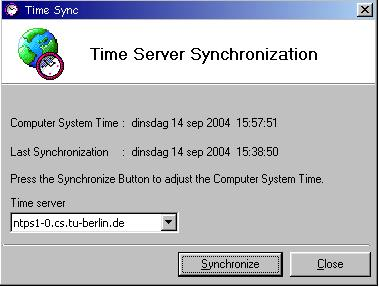



## \[ Time Synchronizer \]

### Description

Always have the EXACT time on your PC. Time Sync connects to atomic clock servers on the net to adjust the inaccurate computer's system time. You can select from a large list of timeservers all over the world. Run the program in normal mode, or without user-interface by the 'now' command to set the time automatically (can be used to synchronize on each startup). When synchronizing, time is automatically adjusted to your local time. Check the Readme File. The date format may only need some adjustment to the format that is common in your region. Special thanks to George McCoy and Jim Huff for the winsock code (see readme file). Your comments are most welcome :-)
 
### More Info
 

             |
---                |---
**Submitted On**   |2004-09-02 22:24:04
**By**             |[D\. Rijmenants](https://github.com/Planet-Source-Code/PSCIndex/blob/master/ByAuthor/d-rijmenants.md)
**Level**          |Intermediate
**User Rating**    |5.0 (40 globes from 8 users)
**Compatibility**  |VB 5\.0, VB 6\.0
**Category**       |[Miscellaneous](https://github.com/Planet-Source-Code/PSCIndex/blob/master/ByCategory/miscellaneous__1-1.md)
**World**          |[Visual Basic](https://github.com/Planet-Source-Code/PSCIndex/blob/master/ByWorld/visual-basic.md)
**Archive File**   |[\[\_Time\_Syn1802171072004\.zip](https://github.com/Planet-Source-Code/d-rijmenants-time-synchronizer__1-56177/archive/master.zip)

